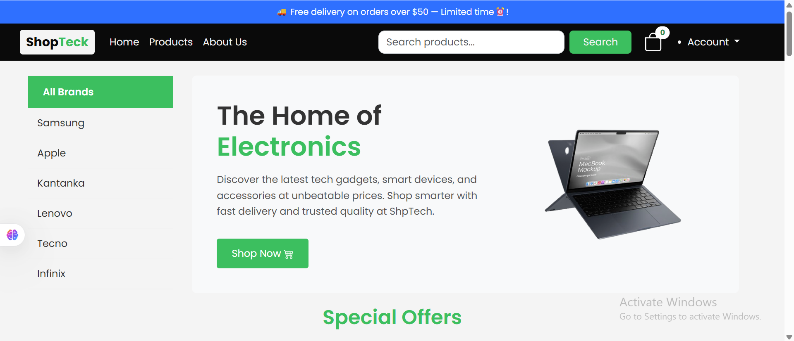
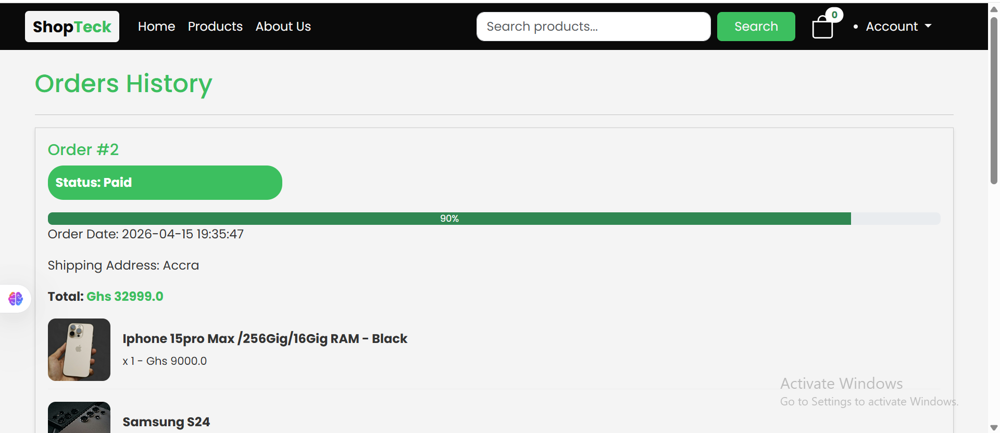

# ShopTech 🛒


A full-stack e-commerce web application for buying phones, laptops, and accessories — with live payment processing via Paystack, order management, and a powerful admin panel. Built with Flask and deployed on Render with Supabase PostgreSQL.

> **Live Demo:** [https://shoptech-w7fj.onrender.com](https://shoptech-w7fj.onrender.com)

---

## Screenshots

> **Homepage**


> **Product Page**


> **Shopping Cart**


> **Checkout & Payment**


> **Order Tracking**


> **Admin Panel**


---

## Features

### Customers
- Browse and search products across multiple categories
- Filter products by category, price, and availability
- Add products to shopping cart and manage quantities
- Secure checkout with **live Paystack payment integration**
- Real-time order tracking with status updates
- Cancel pending orders
- Receive email notifications on order updates
- User registration and login with secure authentication

### Admin
- Full product management — add, edit, delete products
- Upload and manage product images
- View and manage all customer orders
- Update order status (Pending → Processing → Shipped → Delivered)
- Dashboard overview of all store activity

---

## Tech Stack

| Layer | Technology |
|---|---|
| Language | Python 3.12 |
| Framework | Flask 3.1 |
| Database (local) | SQLite |
| Database (production) | PostgreSQL (Supabase) |
| ORM | Flask-SQLAlchemy |
| Migrations | Flask-Migrate / Alembic |
| Payments | Paystack API |
| Authentication | Flask-Login |
| Forms | Flask-WTF / WTForms |
| Email | Flask-Mail (Gmail SMTP) |
| Image Processing | Pillow |
| Templating | Jinja2 |
| Frontend | HTML, CSS, Bootstrap 5 |
| Deployment | Render |
| Server | Gunicorn |

---

## Getting Started

### Prerequisites
- Python 3.10+
- Git
- Paystack account (for payment keys)
- Gmail account (for email notifications)

### Installation

```bash
# Clone the repository
git clone https://github.com/BenjaminTutu/Flask-Ecommerce-Shop.git
cd Flask-Ecommerce-Shop

# Create and activate virtual environment
python -m venv venv

# Windows
venv\Scripts\activate

# Mac/Linux
source venv/bin/activate

# Install dependencies
pip install -r requirements.txt
```

### Environment Variables

Create a `.env` file in the root directory:

```
FLASK_KEY=your-secret-key-here
DATABASE_URL=sqlite:///shoptech.db
EMAIL=your-gmail@gmail.com
PASSWORD=your-gmail-app-password
PAYSTACK_SECRET_KEY=sk_test_xxxxxxxxxxxx
PAYSTACK_PUBLIC_KEY=pk_test_xxxxxxxxxxxx
ADMIN_EMAIL=admin@example.com
ADMIN_PASSWORD=your-admin-password
ADMIN_PHONE=0241234567
```

> For production, replace `DATABASE_URL` with your PostgreSQL connection string.

### Run Locally

```bash
python app.py
```

Visit `http://127.0.0.1:5000`

---

## Payment Integration

ShopTech uses the **Paystack API** to handle secure payments. Paystack supports:
- Debit/Credit cards
- Mobile Money (MTN, Vodafone, AirtelTigo)
- Bank transfers

Making it the ideal payment solution for Ghanaian and African markets.

> For testing payments locally use Paystack's test keys and test card: `4084 0840 8408 4081`

---

## Deployment

This app is deployed on **Render** with **Supabase PostgreSQL** as the production database.

### Environment Variables on Render

| Key | Description |
|---|---|
| `FLASK_KEY` | Flask secret key |
| `DATABASE_URL` | Supabase PostgreSQL connection string |
| `EMAIL` | Gmail address for notifications |
| `PASSWORD` | Gmail app password |
| `PAYSTACK_SECRET_KEY` | Paystack secret key |
| `PAYSTACK_PUBLIC_KEY` | Paystack public key |
| `ADMIN_EMAIL` | Admin account email |
| `ADMIN_PASSWORD` | Admin account password |
| `ADMIN_PHONE` | Admin phone number |
| `FLASK_APP` | `app.py` |

### Start Command

```
flask db upgrade && gunicorn app:app
```

---

## Project Structure

```
Flask-Ecommerce-Shop/
├── app.py                  # App entry point and configuration
├── extension.py            # Database extension
├── models.py               # SQLAlchemy database models
├── command.py              # CLI commands (create admin)
├── requirements.txt        # Project dependencies
├── Procfile                # Render deployment config
├── .env                    # Environment variables (not committed)
├── .gitignore
├── migrations/             # Flask-Migrate migration files
├── routes/
│   ├── auth.py             # Authentication routes
│   ├── admin.py            # Admin routes
│   ├── cart.py             # Cart routes
│   └── orders.py           # Order routes
├── static/
│   ├── css/                # Stylesheets
│   └── images/             # Product and upload images
├── templates/              # Jinja2 HTML templates
│   ├── base.html
│   ├── index.html
│   ├── product.html
│   ├── cart.html
│   ├── orders.html
│   └── admin/
└── screenshots/            # App screenshots for README
```

---

## Order Status Flow

```
Pending → Paid → Processing → Shipped → Delivered
                                      ↘ Cancelled
```

---

## Author

**Benjamin Tutu** — Python Backend Developer, Ghana

- GitHub: [@BenjaminTutu](https://github.com/BenjaminTutu)
- Live Demo: [https://shoptech-w7fj.onrender.com](https://shoptech-w7fj.onrender.com)
- Open to: Part-time backend roles, freelance projects, and collaborations

---

## License

This project is licensed under the MIT License.
